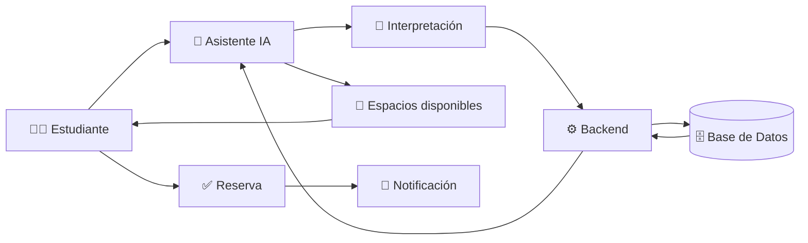

# 🏫✨ Sistema Inteligente de Reserva de Espacios Universitarios

<p align="center">
  
  
  
</p>

<p align="center">
  <b>Una forma más inteligente, rápida y conversacional de reservar espacios universitarios.</b>
</p>

---

## 🌌 ¿Qué es?

En las universidades, muchos espacios de estudio son reservados pero no utilizados. Mientras tanto, otros estudiantes necesitan esos mismos espacios y no pueden acceder a ellos.

💡 **Nuestra propuesta:** crear una plataforma web inteligente que conecte las necesidades de los estudiantes con la disponibilidad real de los espacios universitarios.

El usuario podrá hablar con un asistente de IA utilizando lenguaje natural:

> 💬 *"Necesito un espacio para estudiar con tres compañeros mañana a las 4 de la tarde."*

La IA interpreta la solicitud, el backend consulta la disponibilidad real y el usuario recibe las mejores opciones para reservar.

---

## 🚀 ¿Cómo funciona?



### ✨ Flujo principal

```text
👨‍🎓 Usuario
     │
     ▼
💬 Solicitud en lenguaje natural
     │
     ▼
🤖 Asistente IA
     │
     ├── 📅 Fecha
     ├── 🕐 Hora
     ├── 👥 Personas
     ├── 🏫 Tipo de espacio
     └── 🖥️ Recursos
     │
     ▼
⚙️ Backend
     │
     ▼
🗄️ Base de datos
     │
     ▼
🏫 Espacios disponibles
     │
     ▼
👨‍🎓 Selección del usuario
     │
     ▼
✅ Reserva confirmada
     │
     ▼
📧 Correo de confirmación
```

---

## 🤖 Inteligencia Artificial

La IA funciona como una **interfaz conversacional** entre el estudiante y el sistema.

### Ejemplo

**👨‍🎓 Estudiante**

> Quiero un espacio mañana a las 3 para estudiar con dos personas.

**🤖 IA**

> Encontré dos espacios disponibles para mañana a las 3:00 p. m. ¿Cuál deseas reservar?

El asistente identifica los parámetros necesarios y se los comunica al backend.

### 🧠 Importante

La IA **NO decide qué espacios están disponibles**.

La disponibilidad siempre proviene de la **base de datos**, mientras que el backend se encarga de ejecutar las operaciones reales.

```text
IA
 │
 │ interpreta
 ▼
Solicitud estructurada
 │
 ▼
Backend
 │
 │ consulta
 ▼
Base de datos
 │
 │ disponibilidad real
 ▼
Backend
 │
 ▼
IA
 │
 ▼
👨‍🎓 Usuario
```

Esto permite mantener una separación clara entre:

* 🧠 Interpretación mediante IA
* ⚙️ Lógica de negocio
* 🗄️ Datos reales
* 🔐 Seguridad
* 📧 Notificaciones

---

# 🏗️ Arquitectura

La plataforma estará dividida principalmente en dos servicios:

### 🌐 Servicio Web

Responsable de:

* 👤 Autenticación
* 🏫 Consulta de espacios
* 📅 Gestión de reservas
* 🗄️ Comunicación con la base de datos
* 🤖 Integración con la IA
* 🔐 Control de acceso

### 📧 Servicio de Notificaciones

Responsable de:

* Confirmaciones de reserva
* Recordatorios
* Cancelaciones
* Notificaciones relacionadas con los espacios

---

## ☁️ Infraestructura

El proyecto será desplegado en la nube utilizando una arquitectura preparada para crecer.

```text
                    ☁️ CLOUD
                       │
             ┌─────────┴─────────┐
             │                   │
        🌐 Servicio Web     📧 Notificaciones
             │                   │
             └─────────┬─────────┘
                       │
                 🗄️ Base de Datos
                       │
                 🔐 Seguridad
```

### 🔒 Seguridad

Se contemplan mecanismos como:

* 🔐 HTTPS
* 🛡️ SSL/TLS
* 🚧 Firewall
* 👤 Control de acceso
* 🔑 Variables de entorno
* 🗄️ Base de datos protegida
* 🚫 Protección de credenciales

### 📈 Escalabilidad

La infraestructura podrá incorporar:

* ⚖️ Balanceo de carga
* 📦 Contenedores
* 📈 Escalabilidad horizontal
* ☁️ Servicios administrados en la nube
* 🔄 Automatización del despliegue

---

# ⚙️ CI/CD

El proyecto utilizará **GitHub Actions** para automatizar procesos de integración y despliegue.

```text
👨‍💻 Developer
     │
     ▼
📦 Git Push
     │
     ▼
🐙 GitHub
     │
     ▼
⚙️ GitHub Actions
     │
     ├── 🧪 Tests
     ├── 🔍 Validaciones
     ├── 🏗️ Build
     └── 🚀 Deploy
             │
             ▼
          ☁️ Cloud
```

---

# 🧩 Funcionalidades

### 👨‍🎓 Para estudiantes

* [x] 💬 Solicitudes mediante lenguaje natural
* [x] 🔎 Consulta de disponibilidad
* [x] 📅 Reserva de espacios
* [x] ✅ Confirmación de reserva
* [x] 📧 Notificaciones por correo
* [ ] 🔄 Gestión de reservas
* [ ] ❌ Cancelación de reservas
* [ ] 📜 Historial de reservas

### 🤖 Inteligencia Artificial

* [x] 🧠 Interpretación de lenguaje natural
* [x] 📅 Extracción de fecha y hora
* [x] 👥 Identificación de cantidad de personas
* [x] 🏫 Identificación del tipo de espacio
* [x] 🖥️ Identificación de recursos requeridos
* [x] 🔗 Comunicación con el backend

---

# 🎯 Objetivo

Transformar el proceso tradicional de reserva de espacios universitarios en una experiencia:

> **💬 Conversacional · ⚡ Rápida · 🧠 Inteligente · 🔐 Segura**

El objetivo no es simplemente agregar IA al proyecto.

El objetivo es utilizarla para **resolver un problema real** y mejorar la experiencia de los estudiantes.

---

# 🌟 Ejemplo de experiencia

```text
👨‍🎓 "Necesito estudiar mañana con 3 amigos a las 4."

              ↓

🤖 "Entendido. Buscando espacios para 4 personas
    mañana a las 4:00 p. m."

              ↓

🗄️ Consulta a la base de datos

              ↓

🏫 Sala 204
🏫 Sala 307
🏫 Sala de estudio B

              ↓

🤖 "Encontré 3 espacios disponibles.
    ¿Cuál deseas reservar?"

              ↓

👨‍🎓 "La sala 307."

              ↓

✅ Reserva realizada

              ↓

📧 "Tu reserva fue confirmada."
```

---

# 🛠️ Tecnologías

> Las tecnologías específicas pueden ajustarse durante el desarrollo.

| Área               | Tecnología           |
| ------------------ | -------------------- |
| 🌐 Frontend        | Web                  |
| ⚙️ Backend         | API / Servicios      |
| 🤖 IA              | Modelo de lenguaje   |
| 🗄️ Base de datos  | SQL / NoSQL          |
| ☁️ Infraestructura | Cloud                |
| 🔄 CI/CD           | GitHub Actions       |
| 🔐 Seguridad       | HTTPS / SSL / TLS    |
| 📧 Notificaciones  | Servicio de correo   |
| 📦 Deployment      | Contenedores / Cloud |

---

# 📂 Estructura propuesta

```text
📦 sistema-reserva-universitaria
│
├── 🌐 web/
│   ├── frontend/
│   └── backend/
│
├── 🤖 ai/
│   ├── assistant/
│   └── prompts/
│
├── 📧 notifications/
│
├── 🗄️ database/
│
├── 🧪 tests/
│
├── ⚙️ .github/
│   └── workflows/
│
├── 🔐 .env.example
├── 📄 README.md
└── 📦 docker-compose.yml
```

---

# 📊 Resultado esperado

Al finalizar el proyecto, se espera contar con un prototipo funcional capaz de realizar el siguiente flujo:

**👨‍🎓 Interactuar con el chatbot**

↓

**💬 Expresar una necesidad**

↓

**🤖 Interpretar la solicitud**

↓

**🔎 Consultar disponibilidad real**

↓

**🏫 Mostrar opciones**

↓

**✅ Realizar reserva**

↓

**📧 Enviar confirmación**

---

# 💜 ¿Por qué este proyecto?

Porque reservar un salón no debería sentirse como buscar un tesoro perdido. 🗺️

Queremos que el estudiante simplemente pueda decir:

> **"Necesito un espacio."**

Y que el sistema se encargue del resto. ✨

---

<p align="center">
  <b>🏫 Sistema Inteligente de Reserva de Espacios Universitarios</b>
  <br>
  <sub>Construido con IA, cloud y muchas ganas de hacer las cosas más fáciles. 💜</sub>
</p>


⭐ Proyecto académico orientado a la aplicación de conceptos de telecomunicaciones, sistemas distribuidos, infraestructura en la nube, seguridad, automatización e Inteligencia Artificial.
