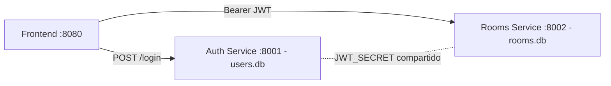

# Proyecto: Sistema Inteligente de Reserva de Espacios Universitarios

## 1. El Problema Real

Los profesores y tutores reservan salas o salones y en muchas ocasiones no asisten, desaprovechando el espacio de estudio. De este modo, privan de su uso a los demás compañeros que realmente lo necesitan.

### El problema

* Reservas que no son utilizadas.
* Espacios de estudio desaprovechados.
* Estudiantes que necesitan espacios pero no pueden utilizarlos.
* Falta de control sobre el uso real de los espacios.

---

## 2. Solución propuesta

El sistema contará con una plataforma web donde los estudiantes podrán:

* Consultar la disponibilidad de los espacios.
* Realizar reservas.
* Solicitar espacios mediante lenguaje natural.
* Interactuar con un asistente conversacional basado en inteligencia artificial.

El asistente funcionará de manera similar a los chatbots utilizados en plataformas como Rappi.

### Ejemplo

> "Necesito un espacio para estudiar con tres compañeros mañana a las 4 de la tarde."

La IA interpretará la solicitud y extraerá información como:

* Fecha y hora.
* Cantidad de personas.
* Tipo de espacio.
* Recursos requeridos.

Posteriormente, el sistema consultará la base de datos para encontrar los espacios realmente disponibles y el asistente presentará las opciones al usuario.

> La IA no determinará la disponibilidad por sí misma. La información será obtenida de la base de datos y el backend será responsable de ejecutar las operaciones de reserva.

---

## 3. Funcionamiento de la IA

El chatbot funcionará como una interfaz inteligente entre el estudiante y el sistema de reservas.

### Ejemplo

**Estudiante:**

> "Quiero un espacio mañana a las 3 para estudiar con dos personas."

**IA:**

Interpreta la solicitud y solicita al sistema:

> Buscar espacios disponibles mañana a las 3:00 p. m. con capacidad para 2 personas.

**Backend:**

* Consulta la base de datos.
* Busca los espacios disponibles.
* Devuelve los resultados.

**IA:**

> "Encontré dos espacios disponibles. ¿Cuál deseas reservar?"

Una vez el estudiante confirma:

* El sistema registra la reserva.
* El servicio de notificaciones envía automáticamente un correo de confirmación.

De esta manera, la IA no se utiliza únicamente como un chatbot informativo, sino como un componente capaz de interactuar con las funcionalidades reales del sistema.

---

## 4. Arquitectura e infraestructura

La solución estará organizada principalmente en dos servicios:

### Servicio Web

Encargado de:

* La interfaz.
* La autenticación.
* La gestión de reservas.
* La comunicación con la base de datos.
* La conexión con la IA.

### Servicio de Notificaciones

Encargado de:

* Enviar correos automáticos relacionados con las reservas.

### Infraestructura

La plataforma será desplegada en la nube y se contemplarán mecanismos de:

* Balanceo de carga y escalabilidad.
* Base de datos protegida.
* HTTPS y certificados SSL/TLS.
* Control de acceso y firewall.
* Variables de entorno para proteger credenciales.
* GitHub Actions para automatizar el despliegue.

Esto permitirá demostrar conceptos de:

* Microservicios.
* Infraestructura en la nube.
* Seguridad.
* Escalabilidad.
* Automatización.

---

## 5. Resultado esperado

Se espera obtener un prototipo funcional donde el estudiante pueda:

* Interactuar con el chatbot.
* Expresar su necesidad.
* Recibir espacios disponibles.
* Seleccionar uno.
* Realizar la reserva.
* Recibir confirmación por correo.

### Valor diferencial

El principal valor diferencial será utilizar la inteligencia artificial para facilitar la interacción y toma de decisiones, en lugar de incorporarla únicamente como un requisito del proyecto.

---

## En resumen

La propuesta busca transformar un proceso tradicional de reserva en una experiencia más sencilla, conversacional e inteligente, utilizando IA para comprender las necesidades del estudiante y conectarlas con la información real de los espacios universitarios.

---

# Primer paso

# Sistema de Reserva de Espacios – UNILLANOS (Parcial I, MVP)

Microservicios PHP + frontend estático. Comunicación HTTP/REST con JWT.


```mermaid
flowchart LR
  F[Frontend :8080] -- POST /login --> A[Auth Service :8001 - users.db]
  F -- Bearer JWT --> R[Rooms Service :8002 - rooms.db]
  A -. JWT_SECRET compartido .- R
```

## Ejecutar localmente
Sin Docker (PHP 8.1+ con pdo_sqlite), tres terminales:
```
export JWT_SECRET=un-secreto-largo
cd auth-service  && php -S localhost:8001 index.php
cd rooms-service && php -S localhost:8002 index.php
cd frontend      && php -S localhost:8080
```
Con Docker: `docker compose up` → http://localhost:8080

## Usuarios demo
| Rol | Correo | Clave |
|---|---|---|
| admin | admin@unillanos.edu.co | Admin123* |
| docente | docente@unillanos.edu.co | Docente123* |
| estudiante | estudiante@unillanos.edu.co | Estudiante123* |

## Roles
- **admin**: crear/editar/eliminar salones, asignar horarios de clase, ver todas las reservas.
- **docente / estudiante**: buscar salones disponibles, ver detalle, reservar y cancelar las propias.

## API (rooms-service)
`GET /rooms?date&start&end&capacity&type&touch_screen&air_conditioning&projector` · `GET /rooms/{id}` · `POST|PUT|DELETE /rooms` (admin) · `POST /rooms/{id}/reserve` · `POST /rooms/{id}/block` (admin) · `GET /reservations` · `DELETE /reservations/{id}`

## Diseño
- **Patrones**: Front Controller, Repository, Middleware (AuthGuard), Service, Validator.
- **Principios**: SRP (una clase por responsabilidad), DIP (inyección por constructor), servicios independientes.
- **Seguridad**: bcrypt, PDO con sentencias preparadas, JWT HS256 con expiración, bloqueo tras 5 intentos, RBAC en backend, validación de entradas, escape de HTML en el cliente, secretos por variable de entorno, `.db` fuera de Git.
- **Modelo de datos**: `users(id,name,email,password_hash,role,…)`; `rooms(id,name,building,type,capacity,touch_screen,air_conditioning,projector,computers)`; `reservations(id,room_id,user_id,date,start,end,purpose,status)`.
- **Evolución**: chatbot IA como tercer servicio que llame a `GET /rooms` y `POST /rooms/{id}/reserve`; servicio de notificaciones por correo; base de datos gestionada + HTTPS + balanceador en la nube; GitHub Actions.
